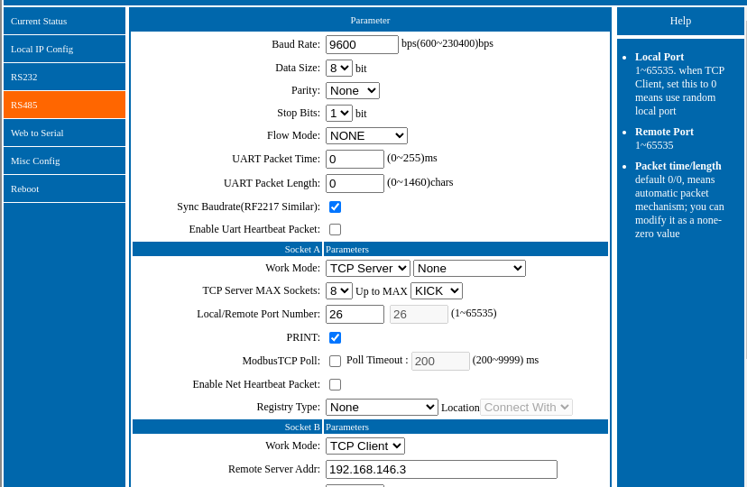

# Daikin EKHHE
das Modul erlaubt es folgende Daikin Brauchwasserpumpen der Firma Daikin in Symcon anzubinden.

- EKHHE200CV37
- EKHHE200PCV37
- EKHHE260CV37
- EKHHE260PCV37

### Inhaltsverzeichnis

1. [Funktionsumfang](#1-funktionsumfang)
2. [Voraussetzungen](#2-voraussetzungen)
3. [Software-Installation](#3-software-installation)
4. [Einrichten der Instanzen in IP-Symcon](#4-einrichten-der-instanzen-in-ip-symcon)

### 1. Funktionsumfang

* Auslesen diverser Daten wie obere/untere Kesseltemperatur, Betriebsmodus, Zustände der Digitalen Eingänge 1-3 u.v.a.m.

### 2. Voraussetzungen

- IP-Symcon ab Version 8.0
- Symbox mit RS-485 Schnittstelle oder ein RS-485 zu Ethernet Adapter bspw. Waveshare RS-485 ETH (selber getestet.) Die RS-485 wird Paralell am Display der Wärmepumpe (Kontakt CN23) angeschlossen. Es werden folgende Einstellungen benötigt:
- 9600 Baud 8/n/1 

 

### 3. Software-Installation

* Über den Module Store das 'Daikin EKHHE'-Modul installieren.

### 4. Einrichten der Instanzen in IP-Symcon

 Unter 'Instanz hinzufügen' kann das 'Daikin EKHHE'-Modul mithilfe des Schnellfilters gefunden werden.  
	- Weitere Informationen zum Hinzufügen von Instanzen in der [Dokumentation der Instanzen](https://www.symcon.de/service/dokumentation/konzepte/instanzen/#Instanz_hinzufügen)

